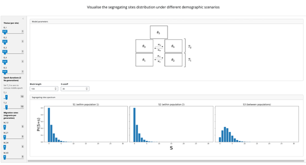

# Sdist-Shiny

A web app for visualising the expected segregating sites distribution under the structured coalescent. This app uses [DISMaL](https://github.com/simonharnqvist/sdist-shiny) to calculate the expected number of segregating sites, given demographic parameter values.



## Web app

The deployed app is available at: https://simonharnqvist.shinyapps.io/sdist_shiny/


## Local installation
You can also run the app locally, for instance if the deployed app on shinyapps.io has run out of hours.

### 1. Install dependencies
Sdist-Shiny relies on `DISMaL`, `shiny`, and some standard Python packages.

It is important to create a fresh environment to avoid `numpy`/`shiny` compatibility issues:
```
mamba create -n shiny_sdist
mamba activate shiny_sdist
```

(Using `mamba` rather than `conda` is preferable, but probably not essential)

Install conda packages:
```mamba install python shiny matplotlib```

Install `DISMaL`:
```pip install git+https://github.com/simonharnqvist/DISMaL.git#egg=dismal```


### 2. Clone git repo
```git clone https://github.com/simonharnqvist/sdist-shiny ```

### 3. Run shiny app
Navigate into `sdist_shiny/sdist_shiny`, and run
```shiny run -b sdist_shiny/app.py```

This should open in your browser (thanks to the `-b` flag; if not, copy the URL from the terminal window and run in your browser.)


