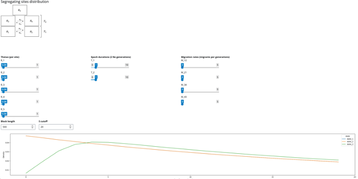

# Sdist-Shiny

A web app for visualising the expected segregating sites distribution



## Installation

### Dependencies needed for installation 
(Suggested versions in brackets)
* Python (3.12)
* Pip (23.3)
 
I would recommend creating a fresh conda environment to avoid NumPy compatibility issues:
```shell
conda create -n sdist_shiny python pip
```

### Install Sdist-Shiny
```shell
pip install git+https://github.com/simonharnqvist/sdist-shiny.git#egg=sdist-shiny
```

That should install all other dependencies.

## Running Sdist-Shiny
Run with
```
sdist-shiny
```

It will take a few seconds for the app to start up. If it doesn't automatically open in your browser, copy the URL from the terminal.